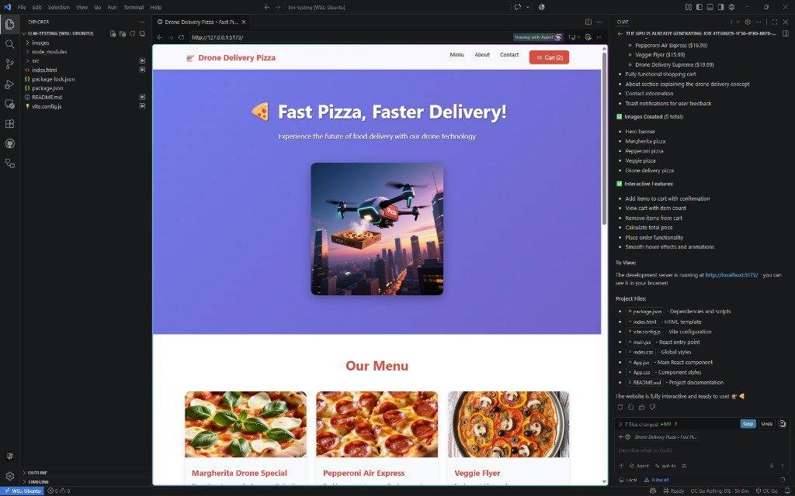
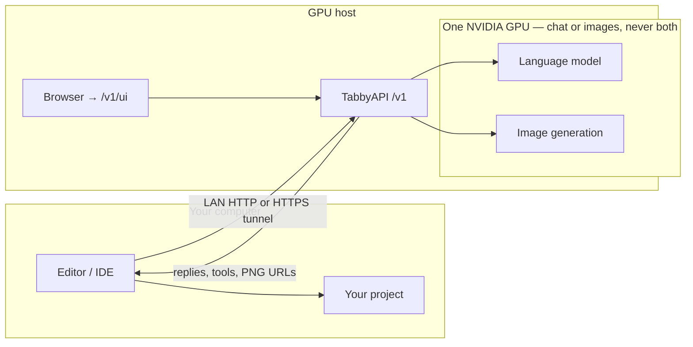
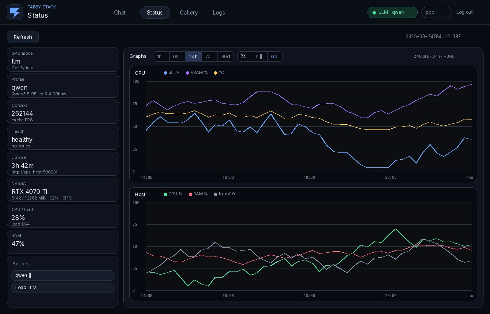
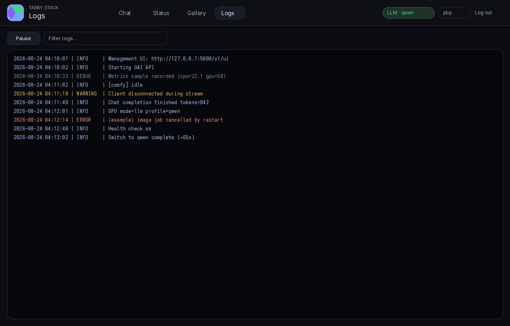
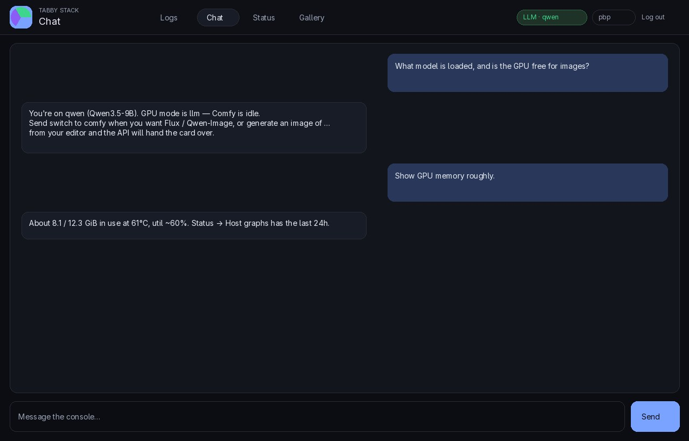
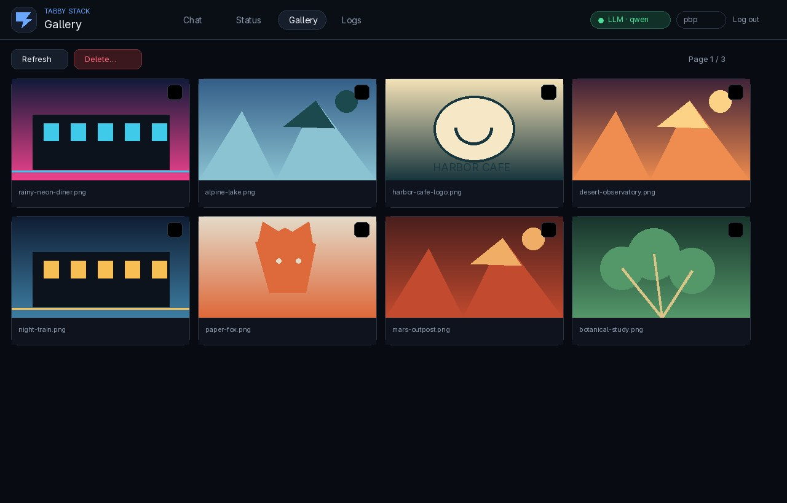

# tabby-stack

Turn an Arch Linux box with an NVIDIA GPU into a private coding assistant and image generator. Keep using Cursor, VS Code, Continue, Cline, or any OpenAI-compatible editor on your everyday machine — point it at this box instead of the cloud.



## How it fits together



| | Role |
|---|---|
| **GPU host** (Arch) | Runs TabbyAPI, the local model, image gen, and the management UI |
| **Your computer** | Runs your editor and your project files |

- Your editor talks to TabbyAPI like OpenAI (`/v1`, model name **`gpt-4o`** — a label only).
- One GPU does **chat or images**, never both at once.
- A signed-in UI at `/v1/ui` covers logs, status/graphs, gallery, and a short console chat.
- No ChatGPT, no Cursor cloud models — this repo plus weights on your hardware.

Built for a **12 GB** NVIDIA card (RTX 4070-class). Details for agents and every IDE: [AGENTS.md](AGENTS.md).

## Install

Arch Linux, an NVIDIA GPU, internet. Run as **your user** (not root), on the Linux disk (not a USB install root).

```bash
sudo pacman -S --needed git
git clone https://github.com/styelz/tabby-stack-archlinux.git "$HOME/tabby-stack"
cd "$HOME/tabby-stack"
bash install.sh
```

Clone into `$HOME/tabby-stack` so updates are `git pull` on that same folder. The installer asks about paths, a weights cache, model set, and listen addresses:

- **core** — coding + images (qwen 9B, Flux, Qwen-Image, CPU embedder)
- **all** — core plus the larger switch profiles

Hugging Face 401/403: `huggingface-cli login` or `HF_TOKEN`, then re-run. USB cache, non-interactive flags, troubleshooting: [tabbyAPI/deploy/arch/README.md](tabbyAPI/deploy/arch/README.md).

## Connect your editor

After install, the API starts on boot. Check it:

```bash
curl -sS http://127.0.0.1:5000/health
```

If nothing answers: `systemctl --user enable --now tabbyapi`. Logs: `journalctl --user -u tabbyapi -f`.

In your editor:

| Setting | Value |
|---|---|
| **Base URL** | `http://<gpu-host>:5000/v1` (LAN/Tailscale), or your HTTPS `/v1` URL |
| **Model** | `gpt-4o` (leave it — the GPU still runs `qwen` or whatever you switched to) |

Some editors only accept `https://`. TabbyAPI itself speaks HTTP on the GPU host; an optional reverse SSH tunnel from a host with a real certificate fixes that. The installer covers **Public URL / tunnel**, or set `TABBY_PUBLIC_BASE` / `TABBY_SSH_REMOTE` later — see the [Arch deploy README](tabbyAPI/deploy/arch/README.md).


## Management UI

Open **`http://127.0.0.1:5000/v1/ui`** (or the same `/v1/ui` path under your HTTPS prefix). Sign in with the **Linux account that runs the stack** (admin). That admin can create extra Tabby-only accounts on the Users page — not Linux users. Extra users get Chat, Status, Gallery, and Logs, but cannot create users. Chat history is per account. Gallery shows each user’s images; the admin sees all.

| Page | Purpose |
|---|---|
| **Logs** | Live journal for TabbyAPI (and Comfy when it is up) |
| **Chat** | Console chat with saved history (New chat / Clear history; Tab loads older chats) — no project file tools |
| **Status** | Mode, health, NVIDIA/CPU/RAM; graphs (1h–30d or custom); switch, restart, update |
| **Gallery** | PNGs under `tabbyAPI/pasted-images/` (your images; admin sees everyone’s) |
| **Users** | Admin only: create, reset, and delete Tabby-only extra accounts |

Day-to-day coding and “build a page + images” still happen in your **editor**, not this console.









## Chat phrases

Send the phrase as the **whole** message (`switch to qwen`, not “please switch to qwen”):

| Phrase | What it does | Ready (warm, 4070 Ti 12 GB) |
|---|---|---|
| `help` | Usage guide | — |
| `list models` | Installed profiles | — |
| `restart` | Bounce the API; last model reloads | ~65 s |
| `switch to qwen` | Daily coding (9B) | ~65 s |
| `switch to qwen35` | Longer / harder agent work | ~3 min |
| `switch to qwen36` | Longer / harder agent work | ~85 s |
| `switch to gemma` | General | ~65 s |
| `switch to gemma26` | Larger general | ~2 min |
| `switch to glm` | Thinking (vision off on 12 GB) | ~15 s |
| `switch to comfy` / `flux` | Hand GPU to image gen | ~35 s, then the picture |
| `switch to llm` | Free Comfy; reload last coding model | ~65 s |

Stay on **`qwen`** for daily work. You can also switch models from **Status** in the UI. Full IDE notes: [AGENTS.md](AGENTS.md).

## Images

One-shot from chat: `generate an image of a neon diner at night` — the API hands the GPU to Comfy, returns a PNG URL on the same host, then reloads the coding model. Or `switch to comfy`, generate several, then `switch to qwen`. Files also appear in the UI **Gallery**.

- **Scenes / heroes:** describe the scene, not a website screenshot.
- **Readable text / logos:** prefix `qwen-image:` (e.g. `qwen-image: a logo that says Harbor Cafe`).
- First Flux ~3 min, first Qwen-Image ~4 min, then ~65 s to bring the LLM back.

**Page plus images** in one chat is a coding task — write HTML/CSS to files, generate the PNGs, point `img` at those paths. Example:

```
Create a cafe landing page under harbor/. Write the HTML and CSS.
Generate harbor/images/header.png of a neon diner street at night,
and qwen-image: harbor/images/logo.png that says Harbor Cafe.
Point the page at those files.
```

The assistant downloads the real API URLs into the project (Shell `curl`). No `mcp.json` required. `POST /v1/images/generations` works the same from any OpenAI-shaped client.

## Update

On the GPU host:

```bash
bash "$HOME/tabby-stack/update.sh"
```

Choose **Update git** (pull; optional restart) or **Update all** (pull, deps, restart, wait for `/health` ~65 s). Flags: `--git`, `--all`, `--restart`, `--no-restart`, `--comfy` (also pull ComfyUI). Same actions exist on the Status page. `config.yml`, `tabby.env`, weights, and the venv stay; OS upgrades (`pacman -Syu`) are still yours.

## License

TabbyAPI code is [AGPL-3.0](LICENSE), same as [upstream TabbyAPI](https://github.com/theroyallab/tabbyAPI). ComfyUI, custom nodes, and weights have their own licenses.
