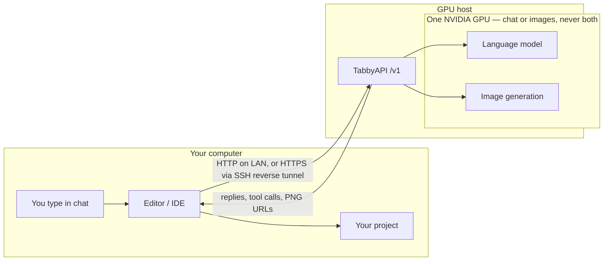

# tabby-stack

Got an Arch Linux box with an NVIDIA GPU sitting around? Put this on it and it turns into your own private coding assistant and image generator. You keep working in Cursor, VS Code, Continue, Cline, or whatever you already use on your everyday machine — you just point it at this box instead of OpenAI.

There's no separate chat window to open on the GPU machine. Your editor is the whole interface.



1. Your editor talks to TabbyAPI, same shape as OpenAI (`/v1`, model name `gpt-4o` — that's only a label). On a LAN that can be plain HTTP. Some editors will only take `https://`, so traffic goes through a reverse SSH tunnel from an HTTPS host — still the same API.
2. TabbyAPI runs a local model on the GPU, or hands that card to image generation. It cannot do both at once.
3. Replies and PNG URLs come back to the editor. The assistant writes code and saves pictures into your project.


## What you get

- Chat and code help from a model running on **your own** GPU
- Image generation on that **same** API, no separate setup
- Model switching from right inside the chat (`switch to qwen`, `switch to comfy`, …)
- An Arch installer that handles packages, Python, model weights, and a service that starts on boot

It's built around a 12 GB NVIDIA card (RTX 4070-class), and everything stays on your own network unless you set up the HTTPS reverse tunnel below (some editors require that).

Under the hood it's just this git repo plus some downloaded model weights (either fetched during install or copied in from a folder you already have) — no ChatGPT, no Cursor cloud models, no separate desktop app to install.

## Two machines

| Machine | What it does |
|---|---|
| **GPU host** (Arch Linux) | Runs the API, the language model, and image generation |
| **Your computer** | Runs your editor or IDE. You open your project here. |

Once it's installed, the API listens on the GPU host. Point your editor at it:

- **Base URL:** `http://<gpu-host>:5000/v1` on the LAN or Tailscale — **or** an `https://…/v1` URL if the editor will not accept HTTP
- **Model:** `gpt-4o`

Don't worry about that model name — it's just a label so editors that only trust known OpenAI names will still let you use tools. Under the hood the GPU is actually running whichever local model you last switched to, which for day-to-day coding is usually **qwen**.

**HTTPS:** some editors refuse a plain `http://` endpoint even on a private LAN. They only accept `https://`. TabbyAPI itself still speaks HTTP on the GPU box. That is the whole reason for the optional reverse SSH tunnel: a host that already has HTTPS (a VPS, a reverse proxy with a real certificate) forwards back to the API. You point those editors at that HTTPS `/v1` URL. The tunnel is a pipe, not a second machine running the model.

The installer asks about this under **Public URL / tunnel**. You can also set `TABBY_PUBLIC_BASE` and `TABBY_SSH_REMOTE` later — see [tabbyAPI/deploy/arch/README.md](tabbyAPI/deploy/arch/README.md).

## Install

You'll need Arch Linux, an NVIDIA GPU, and an internet connection. Run this as **your normal user**, not root, and install it onto the Linux disk itself rather than a USB drive.

```bash
sudo pacman -S --needed git
git clone https://github.com/styelz/tabby-stack-archlinux.git
cd tabby-stack-archlinux
bash install.sh
```

It installs to `$HOME/tabby-stack` by default. Along the way it'll ask where to put things, whether you want a weights cache, which models to grab, and which addresses to listen on.

- **core** — enough to code and make images (qwen 9B, Flux, Qwen-Image, plus a small embedder on CPU)
- **all** — everything in core, plus the bigger models in the switch table below

If Hugging Face throws a 401 or 403 at you, run `huggingface-cli login` (or set `HF_TOKEN`) and try the install again.

Need a USB cache, non-interactive flags, or something went wrong? See [tabbyAPI/deploy/arch/README.md](tabbyAPI/deploy/arch/README.md).

## First use

The installer sets things up to start on boot, so there's no login step. Just check it's actually running:

```bash
curl -sS http://127.0.0.1:5000/health
```

Nothing there? Start it yourself:

```bash
systemctl --user enable --now tabbyapi
```

Want to watch the logs? `journalctl --user -u tabbyapi -f`

From your editor's chat, type one of these as the whole message — just `switch to qwen`, not "please switch to qwen":

| Phrase | What it does | Ready (warm, 4070 Ti 12 GB) |
|---|---|---|
| `help` | Usage guide | — |
| `list models` | Show what is installed | — |
| `restart` | Bounce the API; last model reloads | ~65 seconds |
| `switch to qwen` | Daily coding (9B). Start here. | ~65 seconds |
| `switch to qwen35` | Longer or harder agent work | ~3 minutes |
| `switch to qwen36` | Longer or harder agent work | ~85 seconds |
| `switch to gemma` | General chat | ~65 seconds |
| `switch to gemma26` | Larger general model | ~2 minutes |
| `switch to glm` | Thinking (vision is off on 12 GB) | ~15 seconds |
| `switch to comfy` / `flux` | Hand the GPU to image generation | ~35 seconds, then the picture |
| `switch to llm` | Free image gen; reload the last coding model | ~65 seconds |

One catch: the card can only do **chat or images at a time, never both**. The first Flux picture takes about 3 minutes to warm up, the first Qwen-Image about 4 minutes, and then it takes roughly 65 seconds to bring the coding model back afterward.

For day-to-day work, just stay on `qwen`. If you want the full rundown for any editor or IDE, it's in [AGENTS.md](AGENTS.md).

## Images

**Just want a picture?** Send something like `generate an image of a neon diner at night`. The API hands the GPU over to image generation, hands you back a PNG URL on the same host, then quietly reloads the coding model when it's done.

- For photos and scenes (headers, backgrounds), describe the **scene** itself, not a mockup of a website.
- For logos, posters, buttons, or anything that needs **readable text**, start the prompt with `qwen-image:` — e.g. `qwen-image: a logo that says Harbor Cafe`.

You can also just say `switch to comfy`, wait for it to come up, and describe pictures one after another. `switch to qwen` (or `switch to llm`) whenever you're ready to code again.

**Building a page and want images to go with it?** Something like "create a landing page and generate a header and logo" is really a coding task — the assistant writes the HTML/CSS to files, generates the PNGs, and wires the page up to point at those files, rather than dropping in a screenshot of a finished site.

```
Create a cafe landing page under harbor/. Write the HTML and CSS.
Generate harbor/images/header.png of a neon diner street at night,
and qwen-image: harbor/images/logo.png that says Harbor Cafe.
Point the page at those files.
```

Give the PNGs a path under your site folder, otherwise they'll land in `images/` at the project root. Same timing as above: roughly 3 minutes per Flux picture, 4 per Qwen-Image, then about 65 seconds for the coding model to come back.

## Saving PNGs into the project

The API hands back a URL, and your coding assistant downloads that file straight into the project for you. Chat phrases and `POST /v1/images/generations` both work from any editor that can talk to an OpenAI-compatible API.

When you're building a page plus images, the API kicks off that image job itself from what you typed, and manages the download too — no plugin or `mcp.json` needed for that part.

## License

TabbyAPI code is [AGPL-3.0](LICENSE), the same as [upstream TabbyAPI](https://github.com/theroyallab/tabbyAPI). ComfyUI, custom nodes, and downloaded weights have their own licenses.
